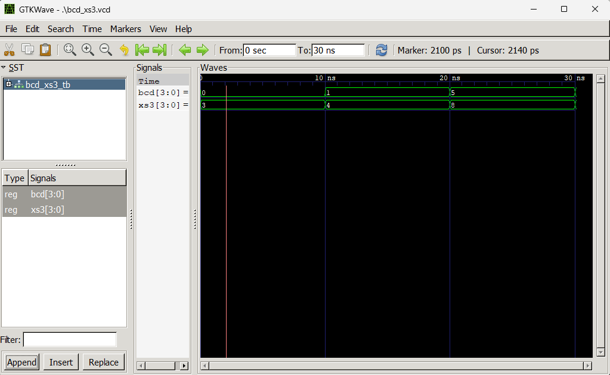
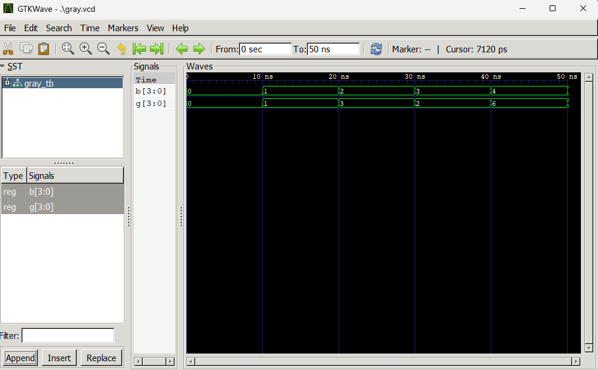

# Lab 6: VHDL Code for Combinational Circuits — Code Converter

**Course:** Computer Architecture (CMP 262)
**Program:** Bachelor of Computer Engineering
**Semester:** Fourth Semester
**College:** Cosmos College of Management and Technology
**Department:** Department of Information and Communication Technology

---

## Objective

- To design and simulate a BCD-to-Excess-3 code converter in VHDL.
- To design and simulate a Binary-to-Gray code converter in VHDL.

---

## Theory

### BCD to Excess-3 (XS-3)

Excess-3 is a non-weighted BCD code obtained by adding 3 (0011) to each BCD digit. It is self-complementing, meaning the 9's complement of any digit can be obtained by simply inverting all bits. This property makes it useful in arithmetic circuits.

| Decimal | BCD (DCBA) | Excess-3 (WXYZ) |
|---------|------------|-----------------|
| 0       | 0000       | 0011            |
| 1       | 0001       | 0100            |
| 2       | 0010       | 0101            |
| 3       | 0011       | 0110            |
| 4       | 0100       | 0111            |
| 5       | 0101       | 1000            |
| 6       | 0110       | 1001            |
| 7       | 0111       | 1010            |
| 8       | 1000       | 1011            |
| 9       | 1001       | 1100            |

In VHDL, this conversion is implemented using the `NUMERIC_STD` library by casting the BCD input to `unsigned`, adding 3, and casting back to `std_logic_vector`.

---

### Binary to Gray Code

Gray code is a binary numeral system where two successive values differ by only **one bit**. This property minimizes errors during transitions and makes it widely used in rotary encoders and digital communication systems.

The conversion rule from Binary (B) to Gray (G) is:

```
G(MSB) = B(MSB)
G(i)   = B(i+1) XOR B(i)
```

In VHDL, this is implemented using the **Dataflow** modeling style with concurrent XOR signal assignments.

### Expected Output — Binary to Gray

| Binary (B) | Gray (G) |
|------------|----------|
| 0000       | 0000     |
| 0001       | 0001     |
| 0010       | 0011     |
| 0011       | 0010     |
| 0100       | 0110     |
| 1111       | 1000     |

---

## Design Files

### 1. BCD to Excess-3 Converter

**Filename:** `bcd_to_xs3.vhd`

```vhdl
library IEEE;
use IEEE.STD_LOGIC_1164.ALL;
use IEEE.NUMERIC_STD.ALL;

entity BCD_TO_XS3 is
    port (
        BCD : in  std_logic_vector(3 downto 0);  -- BCD input (0-9)
        XS3 : out std_logic_vector(3 downto 0)   -- Excess-3 output
    );
end entity BCD_TO_XS3;

architecture Behavioral of BCD_TO_XS3 is
begin
    process (BCD)
    begin
        -- Add 3 to BCD input
        XS3 <= std_logic_vector(unsigned(BCD) + 3);
    end process;
end architecture Behavioral;
```

---

### 2. Binary to Gray Code Converter

**Filename:** `bin_to_gray.vhd`

```vhdl
library IEEE;
use IEEE.STD_LOGIC_1164.ALL;

entity BIN_TO_GRAY is
    port (
        B : in  std_logic_vector(3 downto 0);  -- 4-bit binary input
        G : out std_logic_vector(3 downto 0)   -- 4-bit Gray code output
    );
end entity BIN_TO_GRAY;

architecture Dataflow of BIN_TO_GRAY is
begin
    G(3) <= B(3);              -- MSB stays the same
    G(2) <= B(3) xor B(2);
    G(1) <= B(2) xor B(1);
    G(0) <= B(1) xor B(0);
end architecture Dataflow;
```

---

## Testbench Files

### 1. BCD to Excess-3 Testbench

**Filename:** `bcd_xs3_tb.vhd`

```vhdl
library IEEE;
use IEEE.STD_LOGIC_1164.ALL;

entity BCD_XS3_TB is
end entity BCD_XS3_TB;

architecture Simulation of BCD_XS3_TB is
    signal BCD : std_logic_vector(3 downto 0) := "0000";
    signal XS3 : std_logic_vector(3 downto 0);
begin
    DUT : entity work.BCD_TO_XS3
        port map (BCD => BCD, XS3 => XS3);

    STIMULUS : process
    begin
        BCD <= "0000"; wait for 10 ns;  -- 0 -> 0011
        BCD <= "0001"; wait for 10 ns;  -- 1 -> 0100
        BCD <= "0101"; wait for 10 ns;  -- 5 -> 1000
        BCD <= "1001"; wait for 10 ns;  -- 9 -> 1100
        wait;
    end process;
end architecture Simulation;
```

#### Simulation Commands — BCD to XS3

```bash
ghdl -a bcd_to_xs3.vhd bcd_xs3_tb.vhd
ghdl -e BCD_XS3_TB
ghdl -r BCD_XS3_TB --vcd=bcd_xs3.vcd
gtkwave bcd_xs3.vcd
```

---

### 2. Binary to Gray Testbench

**Filename:** `gray_tb.vhd`

```vhdl
library IEEE;
use IEEE.STD_LOGIC_1164.ALL;

entity GRAY_TB is
end entity GRAY_TB;

architecture Simulation of GRAY_TB is
    signal B : std_logic_vector(3 downto 0) := "0000";
    signal G : std_logic_vector(3 downto 0);
begin
    DUT : entity work.BIN_TO_GRAY
        port map (B => B, G => G);

    STIMULUS : process
    begin
        B <= "0000"; wait for 10 ns;  -- Gray: 0000
        B <= "0001"; wait for 10 ns;  -- Gray: 0001
        B <= "0010"; wait for 10 ns;  -- Gray: 0011
        B <= "0011"; wait for 10 ns;  -- Gray: 0010
        B <= "0100"; wait for 10 ns;  -- Gray: 0110
        B <= "1111"; wait for 10 ns;  -- Gray: 1000
        wait;
    end process;
end architecture Simulation;
```

#### Simulation Commands — Binary to Gray

```bash
ghdl -a bin_to_gray.vhd gray_tb.vhd
ghdl -e GRAY_TB
ghdl -r GRAY_TB --vcd=gray.vcd
gtkwave gray.vcd
```

---

## Simulation Files

| Converter         | Simulation File  |
|-------------------|------------------|
| BCD to Excess-3   | `bcd_xs3.vcd`    |
| Binary to Gray    | `gray.vcd`       |

Both VCD files are generated by GHDL after running their respective testbenches. They record all input and output signal transitions and are loaded into GTKWave for visual verification.

---

## Output

### BCD to Excess-3



**Observation:** For each BCD input, the XS3 output was exactly 3 (0011) more than the input, matching the expected conversion table for all four test cases.

---

### Binary to Gray



**Observation:** For each binary input, the Gray code output matched the expected value. Consecutive Gray code values differed by exactly one bit, confirming correct conversion behavior.

---

## Discussion and Conclusion

This lab demonstrated the design and simulation of two combinational code converters in VHDL. The BCD-to-Excess-3 converter was implemented using the Behavioral modeling style, leveraging the `NUMERIC_STD` library to perform unsigned addition directly on `std_logic_vector` inputs. The Binary-to-Gray converter was implemented using the Dataflow style through concurrent XOR signal assignments, reflecting the direct hardware nature of the conversion. Both designs were verified through dedicated testbenches and GTKWave waveforms confirmed correct outputs for all input combinations. This lab reinforced the use of both Behavioral and Dataflow modeling styles and highlighted how different code conversion techniques are efficiently realized in hardware description languages.
